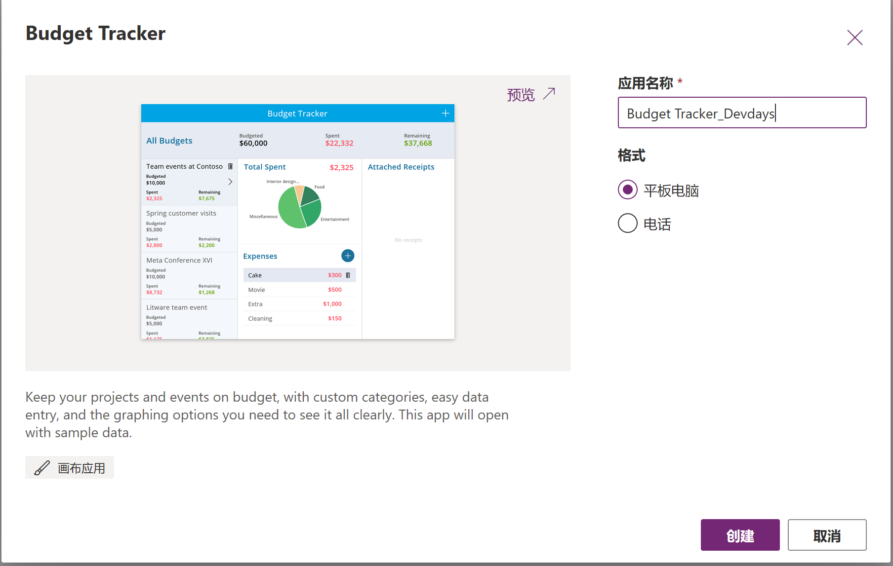
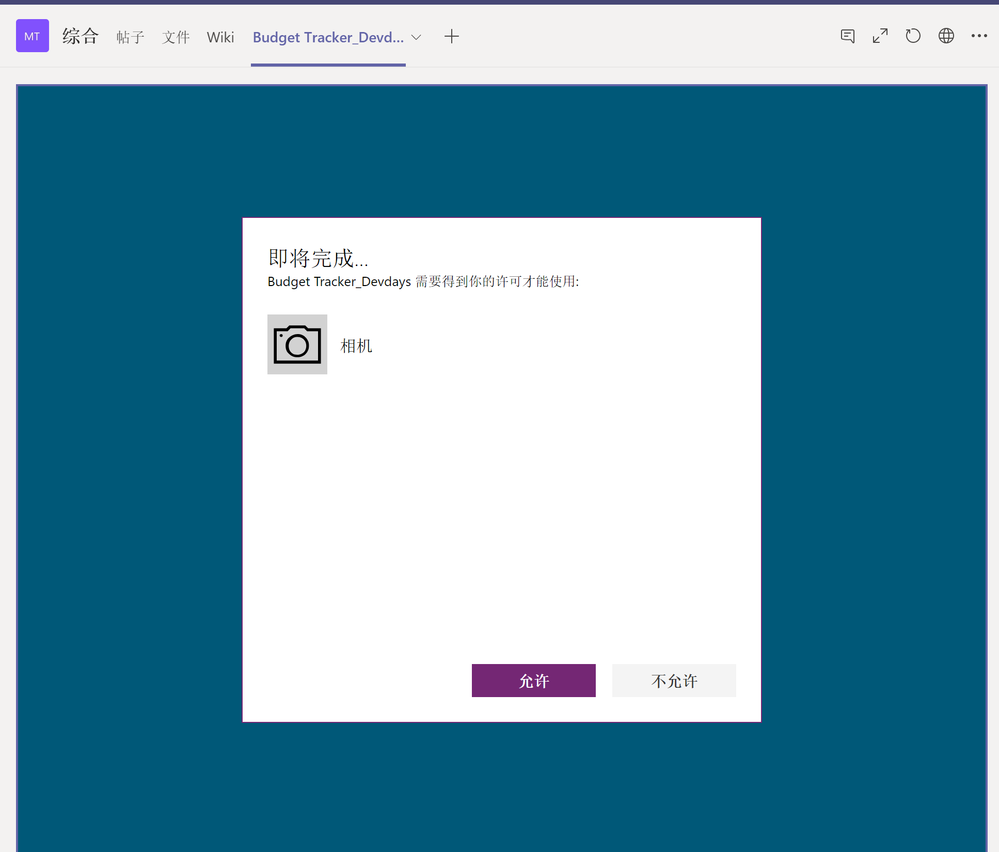
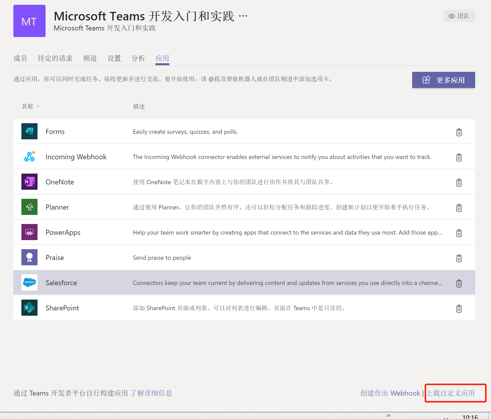
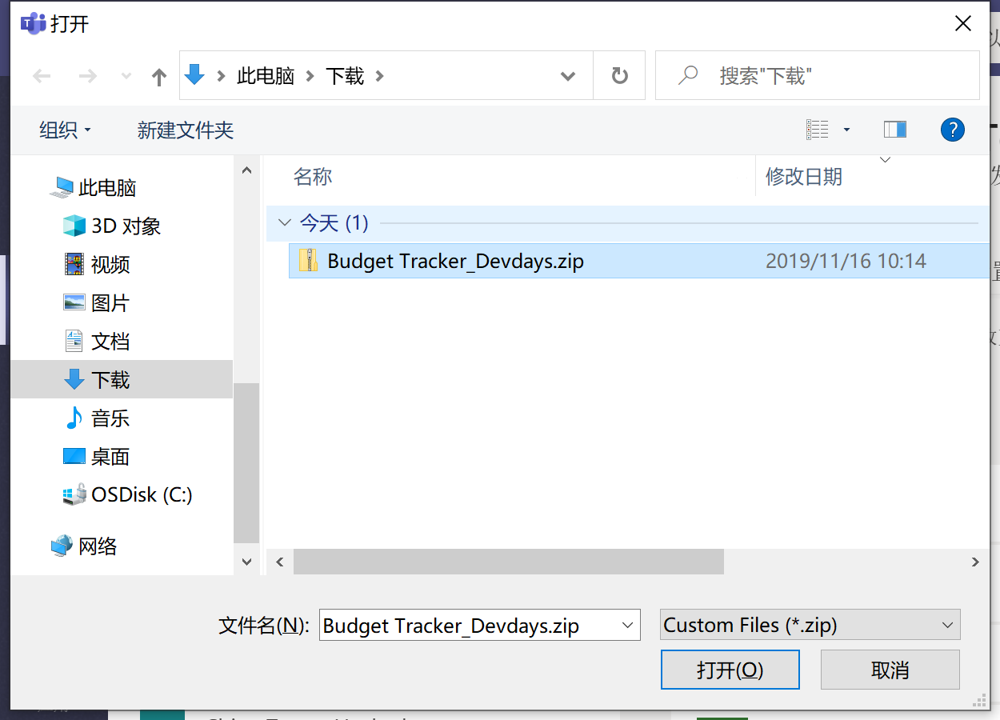

# PowerApps 和 Teams 整合应用开发实战
> 作者：陈希章 时间：2019-11-16 于第六届Microsoft 365 Devdays

## 先决条件

为了完成这个练习，你需要有

1. Office 365 商业版及以上版本（包含Microsoft Teams功能）

## 第一步 了解微软Power Platform的信息

请大家浏览微软Power Platform的官方主页，了解相关的平台信息，尤其是了解PowerApps, Power Automation, Power BI 三者的定位和关系。

<https://powerplatform.microsoft.com/zh-cn/>

## 第二步 登录并创建 PowerApps 应用

1. 请用你的Office 365账号登录到PowerApps的网站，<https://powerapps.microsoft.com/zh-cn/>
1. 基于模板创建一个PowerApps应用，Bug Tracker
    
    
1. 查看生成的这个应用程序，理解数据源，布局，控件，事件等概念
    
1. 运行该应用程序
    
1. 保存该应用（先退出运行模式）
    

## 第三步 通过选项卡将PowerApps应用集成进Microsoft Teams

1. 创建一个用于演练的团队（如果可以的话）
1. 在团队中，找到随意一个频道，在右侧的区域，点击选项卡区域的加号，添加PowerApps这个选项卡
    
    然后在出现的对话框中，选择 “PowerApps”
    
    然后添加
    
    搜索你的应用并点击“保存”
    
    完成授权
    
1. 在Microsoft Teams 中使用这个应用
    

## 第四步 通过导出应用程序包的方式将PowerApps应用分发

1. 回到PowerApps的界面，选择你的应用，并且选择“添加到Teams”这个菜单
    
1. 在下图中点击“下载应用”
    
1. 保存该文件
    
1. 在Teams中打开某个团队的管理界面
    
    在下图中选择“上载自定义应用”
    
    选择你的应用程序包
    
    确认上载成功
    
1. 在Teams中使用这个应用，你在添加选项卡时会看到这个应用
    

## 参考资源

如果你对于Microsoft Teams的应用开发（不管是写代码，还是不写代码都能开发哦）很感兴趣，推荐学习如下中文视频教程

<https://aka.ms/teamsdev163study>